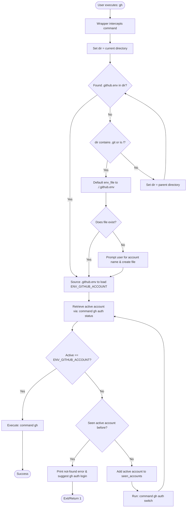

# 🔄 gh-switcher

[](https://www.gnu.org/software/bash/)
[](https://cli.github.com/)
[](https://opensource.org/licenses/MIT)
[](http://makeapullrequest.com)

A robust wrapper function for the GitHub CLI (`gh`) that seamlessly manages and switches between multiple GitHub accounts depending on your workspace/directory.

It intercepts CLI commands, loads or prompts to create a directory-local `.github.env` file to track the desired target account (`ENV_GITHUB_ACCOUNT`), automatically switches the active account if it doesn't match, and detects infinite loops (exiting gracefully if the account is not found after cycling through all configured active accounts).

---

## 🚀 Sourcing Globally (Overwriting Default `gh` Functionality)

To overwrite the default `gh` CLI behavior globally, you need to source the script in your shell configuration. You can do this automatically or manually.

### Option 1: Automatic Installer (Curl & Pipe to Bash)

You can install `gh-switcher` globally using our one-liner installer script. This script downloads the wrapper to `~/.gh-switcher/gh_switcher.sh` and appends a sourcing command to your shell config file (`~/.bashrc` or `~/.zshrc`):

```bash
curl -sSfL https://raw.githubusercontent.com/agalazis/gh-switcher/main/install.sh | bash
```

*Note: If you are using a fork of this repository, replace `agalazis` with your GitHub username.*

---

### Option 2: Manual Sourcing

If you prefer to configure it manually:

1. Clone or download this repository to a local directory (e.g., `~/.gh-switcher`):
   ```bash
   git clone https://github.com/agalazis/gh-switcher.git ~/.gh-switcher
   ```

2. Add a `source` command to your shell's startup configuration:
   * **For Bash:**
     ```bash
     echo "source ~/.gh-switcher/gh_switcher.sh" >> ~/.bashrc
     ```
   * **For Zsh:**
     ```bash
     echo "source ~/.gh-switcher/gh_switcher.sh" >> ~/.zshrc
     ```

3. Reload your shell configuration to apply the changes:
   ```bash
   source ~/.bashrc # or source ~/.zshrc
   ```

---

## 🛠 How It Works

Once sourced, the `gh()` function intercepts your calls to the `gh` command:

1. **Environment Detection**: It checks for a local configuration file (defined by `$GITHUB_ENV_FILE`, defaults to `.github.env`).
2. **Missing Configuration Setup**: If `.github.env` is missing, it prompts you to input your desired account (`ENV_GITHUB_ACCOUNT`), creates the file, and registers it to prevent future prompts.
3. **Automated Switching**: It checks the currently active account. If it doesn't match `$ENV_GITHUB_ACCOUNT`, it runs `gh auth switch` automatically to cycle through accounts.
4. **Cycle/Loop Prevention**: It tracks the accounts it has seen. If it cycles back to an account a second time without locating the target account, it halts, reports that the account was not found, and suggests running `gh auth login`.
5. **Execution**: Once satisfied, the wrapper forwards your arguments transparently to the underlying `gh` binary.

---

## 📊 Flowchart




