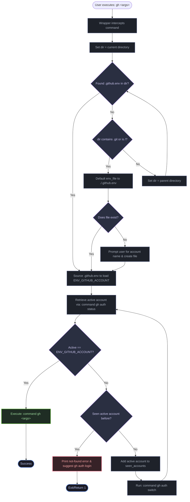

# 🔄 gh-switcher Architecture & Flow

This document details how the `gh-switcher` wrapper function intercepts your commands, locates the correct workspace environment file, switches active accounts, and executes the requested actions.

---

## 🗺 Interactive Flowchart

Here is the decision path the wrapper takes every time you run a `gh` command in your terminal:

---

## 📋 Step-by-Step Overview

1. **Interception**: When you run `gh`, the shell executes the wrapper function `gh()` instead of the global CLI binary.
2. **Upward Traversal**: The script walks up parent directories starting from your current working directory to find a `.github.env` file. It stops if it encounters a directory containing `.git` or hits the root `/` directory to preserve project isolation.
3. **Workspace Initialization**: If no configuration exists within the repository boundary, the script prompts you to enter the target username and saves it in a new local `.github.env` file.
4. **Active Check**: It requests the current active account using `command gh auth status`.
5. **Auto Switch & Cycle Check**:
   - If the active account matches the target, it breaks the loop.
   - If not, it checks if it has seen this active account during this execution. If yes, it means it is looping (and the target account is not logged in). It prints a login suggestion and returns `1`.
   - If it has not seen it yet, it tracks the account and runs `command gh auth switch` to cycle to the next account.
6. **Execution**: The script transparently runs the original command with your arguments using the underlying `gh` binary.
